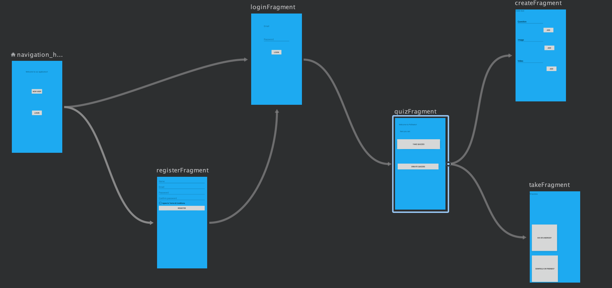

# Pollinator_StaticDemo_Kotlin
🐝 mobile app that allows users to create and take quizzes, connect with other users and share quizzes on social media
# _Pollinator_Mobile_Version_

#### _A mobile application that allows user to create and take quizzes, share on social media, connect with other users. Created 09/26/2019_

#### By _**Maryana Antonyuk**_

## Description

_A web application for a  which allows_

## Specifications

* The application has authentication and authorization.
* The application will allow to create a new user account .
* The user will be offered following options 
  -create quizzes
  -take quizzes
  -see (instant) results
  -connect with other "pollinators"
  -share your polls on social media
* The user should be able to add images, videos, links.

## Setup/Installation Requirements

* Download and install Android Studio
* Clone this repository: $ git clone repo name
* Change into the work directory: $ cd repo name
* Run the project

## Support and contact details

_If you run into any issues or have questions, ideas or concerns. Please contact me at amaryana@gmail.com_

## Technologies Used

* Kotlin/Java
* CSS/HTML
* Bootstrap
* XML

### License

*MIT*

Copyright (c) 2019 **_Maryana Antonyuk_**
